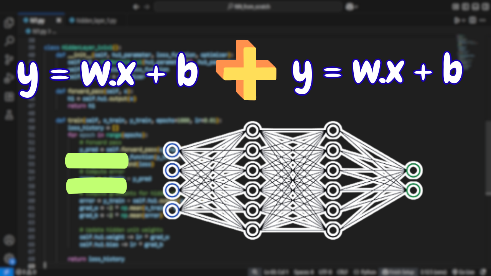

# From Linear Equation to Neural Network

  

This project builds a neural network from scratch using only NumPy, starting from a basic linear equation (`y = wx + b`) and gradually stacking multiple such units to approximate nonlinear functions like `sin(x)`.

## 📺 Watch the Project Demo

Check out the full walkthrough on YouTube:  
🔗 [From Linear Equation to Neural Network – Full Video](https://youtu.be/0iT1pXd9c9o)

## 📇 Connect with Me

🔗 [LinkedIn – Soudeepan Biswas](https://www.linkedin.com/in/soudeepanbiswas/)

## 📌 Highlights

- Built with just NumPy — no ML frameworks used.
- Understand how weights and biases form a neuron.
- Visualize learning by plotting predicted vs. actual `sin(x)`.
- Tanh activation and Xavier initialization.
- Manual gradient descent and weight updates.

## 🧠 Core Concepts

- Linear Equation (`y = wx + b`)
- Hidden Units
- Forward Pass
- Tanh Activation
- Manual Backpropagation
- Loss Minimization
- Sine Function Approximation

